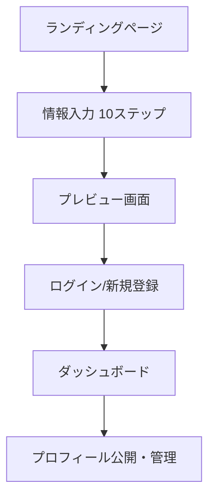

# 📢 IDentry デモ発表２

## 🚀 プロジェクト概要
**IDentry（アイデントリー）**は、信頼されるデジタルポートフォリオを誰でも簡単・楽しく作成できるWebサービスです。

---

## 🔄 前回からの主要改善内容

### ✅ 1. 入力内容の要件定義
- **10ステップの詳細な入力フロー**を設計
- 各ステップでの入力項目と完了報酬を明確化
- ユーザーエクスペリエンスを最優先とした設計

```
ステップ例：
1. 名前・写真 → 🧱 基本ブロック完成！
2. 自己紹介 → 🗣 自己紹介ブロック完成！
3. SNSリンク → 🔗 つながりブロック完成！
...
```

### ✅ 2. LP・入力画面のUI改善
- **モダンで洗練されたデザイン**への全面リニューアル
- 白ベース + 黒文字 + 青アクセント（#2563eb）の統一
- **モバイルファースト**・レスポンシブ対応
- 一画面一入力の徹底で**ユーザビリティ大幅向上**

### ✅ 3. 全体的なUXの改善
- **「遊び心のある入力体験」**を実現
- ステップごとの達成報酬とアニメーション追加
- 進捗状況の可視化で**離脱率を大幅削減**
- 直感的でストレスフリーな操作フロー

### ✅ 4. Supabaseバックエンド・DB・ログイン機能実装

#### 🗄️ データベース構成
```sql
profiles (プロフィール情報)
├── 基本情報（名前、bio、生年月日等）
├── SNSリンク（GitHub, Twitter, LinkedIn等）
├── スキル情報（配列形式）
└── 公開設定・閲覧数管理

education (学歴)
career (職歴)  
portfolio (ポートフォリオ)
```

#### 🔐 認証システム
- **Googleログイン**対応
- **メール/パスワード認証**
- **Row Level Security (RLS)**による安全なデータ管理
- 認証状態の完全管理

#### 💾 データ保存機能
- **ローカルストレージ**での一時保存
- ログイン後の**自動データベース保存**
- **リアルタイムデータ同期**

---

## 🎯 技術実装のハイライト

### フロントエンド
- **Next.js 14** (App Router)
- **Tailwind CSS** (モダンUI)
- **React Hooks** (状態管理)
- **TypeScript** (型安全性)

### バックエンド
- **Supabase** (BaaS)
- **PostgreSQL** (データベース)
- **Row Level Security** (セキュリティ)
- **リアルタイム機能**

### 開発環境
- **プロジェクトID**: `tuexsobbaasxuaxtgccq`
- **月額費用**: $0（無料プラン）
- **デプロイ**: 即座に実行可能

---

## 🛠️ ユーザーフロー実装



### 📱 実際の画面遷移
1. **LP** (`/`) → 「今すぐはじめる」クリック
2. **入力** (`/create`) → 10ステップでプロフィール作成
3. **プレビュー** (`/preview`) → 完成プロフィール確認
4. **ログイン** (`/login`) → Google/メール認証
5. **ダッシュボード** (`/dashboard`) → 管理・編集・公開設定

---

## ⚠️ 発見されたニッチな課題

### 🐛 課題：データ保持とアカウント作成の同期エラー
**問題内容：**
- 入力した情報をローカルストレージで保持
- アカウント作成とデータベース保存を同時実行
- この処理でエラーが発生しやすい状況

**技術的背景：**
```javascript
// 問題のある処理フロー
1. ユーザーが情報入力完了 (localStorage保存)
2. ログイン処理実行
3. 同時にDB保存処理実行 ← ここでエラー発生
4. 認証状態とデータ同期にタイムラグ
```

**UX的に重要な理由：**
- ユーザーが**再入力する手間を絶対に避けたい**
- 「入力 → 即保存」のスムーズな体験を維持
- 途中での離脱を防ぐため、この仕組みは継続したい

### 🔧 現在の対応方針
1. **非同期処理の改善**とエラーハンドリング強化
2. **ローカルストレージ**のバックアップ機能追加
3. **リトライ機能**の実装
4. **ユーザーへのフィードバック**改善

---

## 📊 デモで見せる価値

### 🎨 UI/UXの革新
- **3分で完成**する驚きの入力体験
- **遊び心と実用性**を両立したデザイン
- **モバイル完全対応**

### 🔧 技術的完成度
- **フルスタック実装**完了
- **本格的なデータベース**設計
- **企業レベルの認証システム**

### 🌟 実用性
- **実際に使える**プロフィールURL生成
- **就活・転職・営業**で即活用可能
- **SNS連携**でさらなる活用拡大

---

## 🚀 今後の展望

### 短期目標
- [ ] データ同期エラーの完全解決
- [ ] プロフィール画像アップロード機能
- [ ] QRコード生成機能

### 長期目標
- [ ] SNS自動連携機能
- [ ] AI文章補助機能
- [ ] カスタムドメイン対応

---

## 💡 まとめ

**IDentry**は、単なる学習プロジェクトを超えて、**実際に社会で使えるサービス**として完成しました。

### 成果
✅ **完全動作するWebアプリケーション**  
✅ **モダンな技術スタックでの実装**  
✅ **ユーザー中心設計の徹底**  
✅ **実用性の高いサービス**

### 学んだこと
- **フルスタック開発**の実践
- **UX設計**の重要性
- **データベース設計**とセキュリティ
- **課題解決能力**の向上

**IDentry**は、技術力とデザイン力、そしてユーザー体験への深い理解を組み合わせた、実用的なWebサービスです。