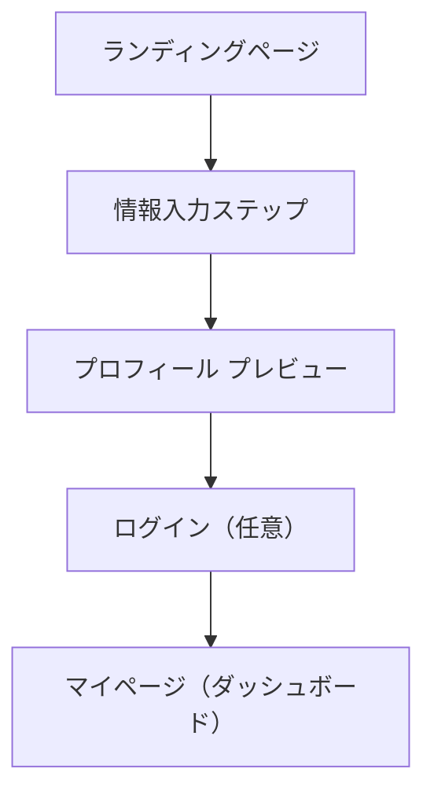

# 📘 要件定義書：IDentry ユーザーフロー（初回利用）

## 🏷️ サービス名：**IDentry**

## 🎯 サービス概要
**IDentry（アイデントリー）**は、信頼される自分のプロフィール（ポートフォリオ）を、楽しく・簡単に作成・公開できるWebサービスです。  
情報入力を「ブロック破壊」的な感覚で1ステップずつ行い、退屈さを排除したスムーズな体験を提供します。

---

## 🌐 ユーザーフロー全体図

---

## 🧩 基本設計原則（UX・UI）

- UIは**「一画面一入力」**。複数のフォーム・選択肢は一切出さない
- ステップごとに**目的と完了報酬（アニメーションや絵文字）**を表示
- 各ステップで**ユーザーが何をしているのか・次に何をすべきか**が常に明示される
- 色は **白ベース + 黒文字 + 青アクセント（#2563eb）**
- モダンで洗練された余白を活かしたデザイン
- 完了時点で即URLシェアできる状態に

---

## 🧭 ユーザーフロー詳細

### 1. 🚪 ランディングページ（`/`）

| 項目 | 内容 |
|------|------|
| 目的 | サービスの価値・流れ・特徴を、視覚的にシンプルに伝える |
| 主な構成 | キャッチコピー / 図解フロー / 「はじめる」ボタン |
| UI構成例 | ヒーローセクション, 利用ステップ（入力→完成→共有）, CTAボタン |

---

### 2. ✏️ 情報入力ウィザード（`/create`）

| 項目 | 内容 |
|------|------|
| 目的 | ユーザーがプロフィール情報を1ブロックずつ入力 |
| UIルール | 一画面一入力 / フォーム最小限 / 完了後アニメ付き報酬表示 |

---

### 3. 🔍 プロフィールプレビュー（`/preview`）

| 項目 | 内容 |
|------|------|
| 目的 | 入力情報を1ページにまとめて確認・公開イメージを表示 |
| 機能 | プロフィール完成図、次ステップ（保存・共有したい→ログイン） |

---

### 4. 🔐 ログイン（`/login`）

| 項目 | 内容 |
|------|------|
| 目的 | プロフィールの保存・再編集・公開範囲管理のため |
| 選択肢 | Googleログイン / メール認証登録 |
| 備考 | ログインしなくても一時シェア可能（セッション保存） |

---

### 5. 🏠 マイページ（ホームダッシュボード）（`/dashboard`）

| 項目 | 内容 |
|------|------|
| 目的 | プロフィールの編集・管理・公開設定 |
| 主な機能 |  
  - バナー画像変更  
  - アイコン変更  
  - ニックネーム設定  
  - 各ブロックの編集  
  - QRコード生成・URLコピー  
  - 公開/非公開設定（ブロックごと） |

| UI特徴 | 洗練されたカード型レイアウト、シンプルで余白多め、青アクセント使用 |

---

## 🧠 今後の発展ポイント（オプション）

- 公開ページに「評価」「推薦」「タグ検索」などソーシャル要素追加
- スマホ最適化設計（モバイル・タブレット対応）
- コンテンツテンプレートやAIによる文章補助機能

---

## ✅ まとめ

- 一画面一機能に徹し、UXの一貫性と遊び心のある演出で入力のストレスを排除
- 信頼されるデジタルIDを誰でも簡単に作成・共有できる
- 非ログインでも一時的に成果を出力でき、ログインで管理に移行可能